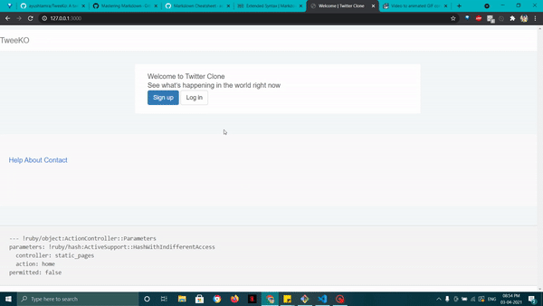
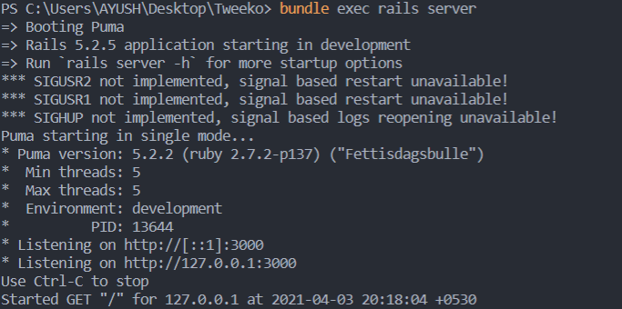

# TweeKo
### A twitter clone built using ruby on rails currently having a basic User interface
<p align="center">
    
</p>
<!--  -->

> Hey, Welcome to the world of tweeks

## 🧐Key features:

- Works on CRUD
    - [x] Creation of a tweek
    - [x] Read a tweek
    - [x] Deletion of a tweek
    - [ ] Updation of a tweek
- Uses sqlite3 for database <br>
#### Implementations:
- [x] User signup/signin
- [x] Create a tweek
- [x] Delete a tweek
- [x] Can see other user's profile
- [x] Follow/Unfollow another user
- [x] Can see tweeks by other users
- [x] User can edit profile and can add profile photo through Gravatar
- [ ] Update a tweek

## 🏁Getting started:

### Step 1:
Install ruby on your system: [Ruby official](https://rubyinstaller.org/ "Ruby installer")

### Step 2:
Setup ruby on rails: [Getting Started with Rails](https://guides.rubyonrails.org/getting_started.html "Ruby on rails")

Glad you came to this point, now follow this:
### Step 3:
Check webpacker is installed globally in your system:
```
webpacker -v
```
If not installed:
```npm
npm install --global webpack
```
### Step 4 (🚀Deployment):
Clone this repository on your local system and cd to the directory <br>
Using terminal write this:
- For installing the bundles
```
bundle install
```
- Migration into the database:
```
bundle exec rails db:migrate
```
- Executing the rails server on Localhost
```
bundle exec rails server
```
### 🎉Voila..!! the rail server starts:
<p align="center">
    
</p>
<!--  -->
<br> <br>
With just three commands we whipped up a Rails server listening on port 3000. Go to your browser and open http://localhost:3000, you will see TweeKo running.